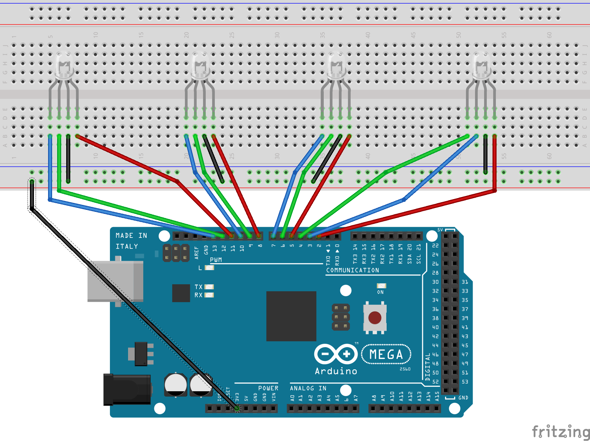

# Building the Robot

You will need:

* 4 Common Cathode RGB LEDs (see note if you end up with common anode)
* ~20 breadboard wires
* Arduino Mega

Follow the following diagram:



Common Anode LEDs?

All you need to do is wire the second pin to GND instead of 3.3v, and in the `robot-schematic/robot-server.js` code, change the following:

```javascript
//re-render robot here.
for(var led = 0; led < 4; led++){
    leds[led].color([
      255 - colors_on_display[led][0], 
      255 - colors_on_display[led][1], 
      255 - colors_on_display[led][2], 
    ]);
}
```

to:

```javascript
//re-render robot here.
for(var led = 0; led < 4; led++){
    leds[led].color([
      colors_on_display[led][0], 
      colors_on_display[led][1], 
      colors_on_display[led][2], 
    ]);
}
```